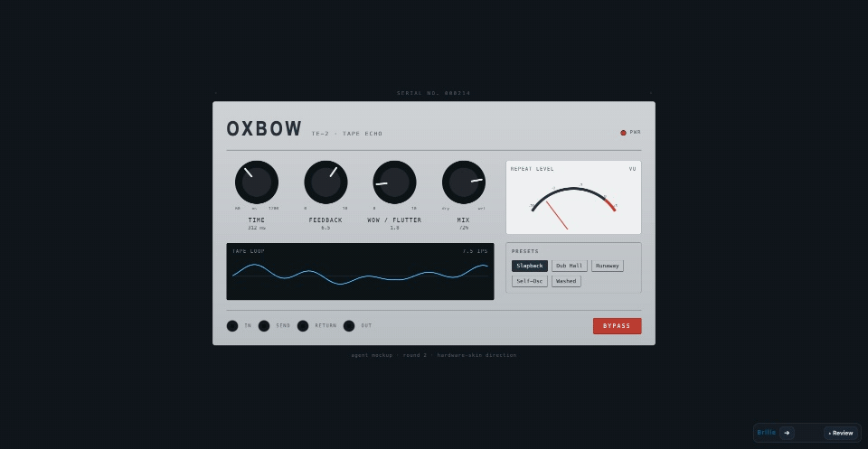
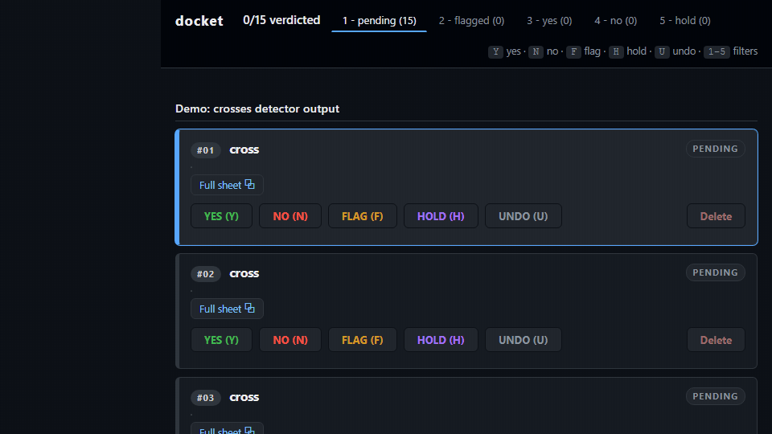
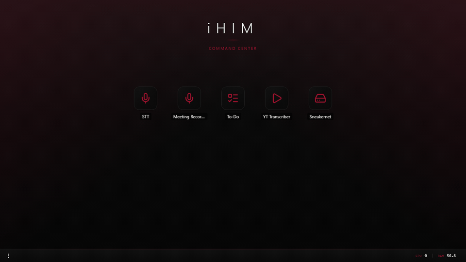

# Race Nevils

I build tools that solve the problems in front of me and make my workflow more efficient.

Current focus: Strengthening my foundations by learning C.

### [brille](https://github.com/race-nevils/brille)

Your agent renders the UI change as ephemeral HTML in your own design system. Annotate your changes, compare the cuts, drag what's misplaced, hit send, and it rebuilds.

 JavaScript ·  CSS ·  Python ·  HTML

### [docket](https://github.com/race-nevils/docket)

The keyboard-first, human-in-the-loop bench for computer vision ML work.

 Python

### [iHIM](https://github.com/race-nevils/ihim)

A personal app platform and control plane for local tooling.

 Python ·  JavaScript ·  CSS

## Beyond The Repos

The rest of my work lives outside these repos, most of it under my company, EdgeFlow AI.

- I am building a proprietary computer vision model end to end: dataset design, synthetic data generation, training, and evaluation.
- RDF knowledge graphs in JSON-LD with my own query engine on top. A plain-English question compiles to a graph walk that runs on two engines, SPARQL and Gizmo.
- I self-host my sites through a Cloudflare Tunnel, and an access layer curates the traffic while in development.

---

Open to work in: software and tech-adjacent roles  
Email: race.nevils@edgeflowai.com  
LinkedIn: [linkedin.com/in/race-nevils](https://linkedin.com/in/race-nevils)
