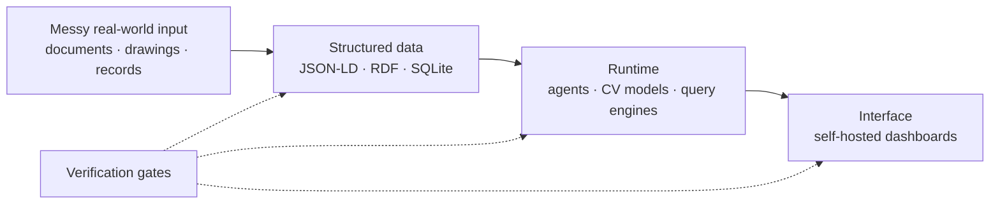

# Race Nevils

I build full pipelines that take messy input and turn it into a verified answer.

## Currently building

- A symbol detector for construction blueprints, trained on synthetic data generated from measurements of the real drawings rather than drawn by eye.
- A pipeline that turns public procurement records into queryable linked data, where every node carries a provenance trail back to its source document.
- A model-agnostic agentic runtime with a self-hosted control plane, so I can watch any job while it runs.

**Stack:** Python, linked data (JSON-LD, RDF, SPARQL), LLM tooling, YOLO, SQLite, plain-JS frontends

[LinkedIn](https://linkedin.com/in/race-nevils)
